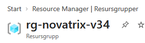
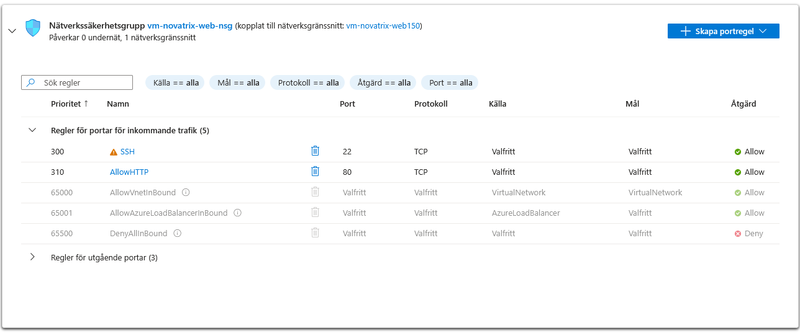
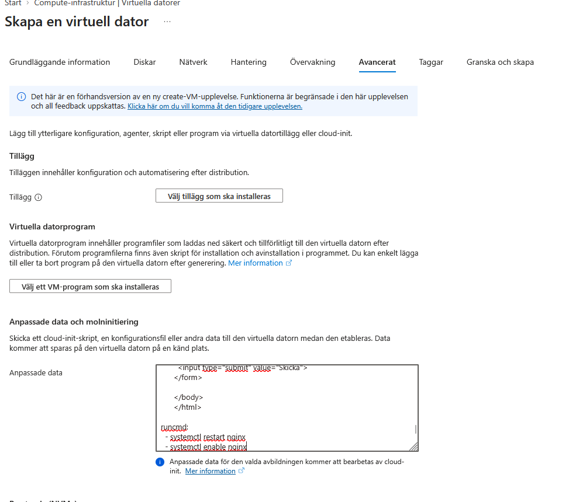

# V.34 Novatrix, driftsättning av webbserver i Azure

**Repo: https://github.com/00aughar/azure-Mov25.git**

**August Hartwig** 
**MOV25** 
**25/8**

**Innehåll**
- Resursgrupp och provisionerat VM
- SSH nyckel & anslutning till VM
- Serverkonfiguration och installation av Nginx
- Driftsättning
- Verifiering

## 1. Resursgrupp och provisionerat VM

Via Azure Portalen skapa resursgrupp **"rg-novatrix-V34"**.

Provisionerat VM **"vm-novatrix-web"** skapad via Azure Portalen inom resursgrupp **"rg-novatrix-V34"**

- VM har operativsystem **"Ubuntu Server LTS 24.04 - x64 Gen2"** 
- Maskinstorlek på VM **"B2ats_v2"**

Port **80** för **(HTTP)** och **22** för **(SSH)** öppnad på VM via Azure Portalen för trafik

Resultat: 





## 2. SSH nyckel & anslutning till VM

SSH nyckel genererad via Azure för fjärranslutning till VM **"vm-novatrix-web"**

Navigering till SSH nyckel:
```cd "C:\Skolarbete\Microsoft Azure\V.34"```

Sätt behörighet på nyckel:
1. ```icacls .\vm-novatrix-web_key.pem /inheritance:r```
2. ```icacls.\vm-novatrix-web_key.pem /grant:r "$($env:USERNAME):R"```

Anslut till server:
```ssh -i .\vm-novatrix-web_key.pem azureuser@172.160.243.203```

Resultat: 

## 3. Serverkonfiguration och installation av Nginx

1. Serverkonfiguration & uppdatering

Sökning av uppdateringar på VM: ```sudo apt update```

Nedladdning & uppdatering av server: ```server sudo apt upgrade -y```

2. Installation av Nginx

Installationskript: ```sudo apt install nginx -y```

Kontrollera att Nginx är installerad: ```systemctl status nginx```

Reslutat: 

## 4. Driftsättning

Konfiguration av html websidan

Navigera till nginx innehållssida ```cd /var/www/html/```

Redigering av innehållssida ```sudo nano index.html```


html websida konfiguration:

```
<!DOCTYPE html>
<html>
<head>
<title>Welcome to Novatrix</title>
<style>
html { color-scheme: light dark; }
body { width: 35em; margin: 0 auto;
font-family: Tahoma, Verdana, Arial, sans-serif; }
</style>
</head>
<body>
<h1>Welcome to Novatrix</h1>
<p></p>

<form>
  <label for="name">Namn:</label><br>
  <input type="text" id="name" name="name"<br>
  <br><label for="mail">Mail:</label><br>
  <input type="text" id="mail" na  <br><label>
<br><label for="mail">Meddelande:</label><br>
<input type="text" id="msg" na <br><label>
<input type="submit" value="Skicka"
</form>


</body>
</html>
```

## 5. Verifiering

Besök websidan via serverns publika IP-address

Reslutat: 

## Challenge Cloud-init konfiguration

Jag påbörjar en ny konfiguration av en virutell maskin efter jag har skapat en resursgrupp. Virtuell maskin konfigureras på samma sätt som vid tidigare moment. Under konfiguration navigerar jag till "Avancerat" där jag fyller i min "cloud.init.yaml" kod för att konfigurera vad maskinen ska göra vid uppstart. 

Installation av uppdateringar samt nginx paketet:
```
package_update: true
packages:
  - nginx 
  ```
Konfiguration av HTML websidan. HTML kod efter "Content:" likt tidigare konfigurationen i driftsättniningen.
  ```
write_files:
  - path: /var/www/html/index.html
    owner: www-data:www-data
    permissions: '0644'
    content:
  ```
Omstart av server efter HTML konfiguration.
```
runcmd:
  - systemctl restart nginx
  - systemctl enable nginx
  ```

Ifyllt cloud.init script "Anpassad data"


Verifiering: Efter HTTP port 80 öppnats besök den offentliga IP-addressen för maskinen för att verifiera att konfiguration efter cloud.init scriptet har fungerat. Samt anslut via SSH till den virtuella maskinen via terminalen.


## Challenge deploy.sh script - Automation av resursgrupp och provisionering av VM 

Istället för att konfigurera resursgrupp, VM manuellt gjorde jag en automatisering av flödet via Azure CLI med ett deploy.sh script. Genom att köra scriptet byggs en komplett webbservermiljö utan manuella steg. Sciptet använder även tidigare cloud.init konfigurationen för att konfigurera uppstart av VMen, uppdateringar, nginx installation & uppbyggnad av html websidan.

Scriptet delas i 5 olika delar:
- 1. Variabler som definnerar den namn,geografisk plats,adminanvändare & maskinstorlek på resursgrupp & den virutella maskinens 
- 2. Skapandet av resursgruppen & bestämd geografisk plats
- 3. Provisionering av Virutell maskin & cloud-init scriptet körs vid uppstart av VM
- 4. Tillåter trafik på port 80 för HTTP åtkomst till webbserver
- 5. Serverns publika IP adress för verifiering att webservern är igång

deploy.sh-skriptet körs i Git Bash-terminalen i Visual Studio Code med en aktiv Azure CLI-anslutning:

```

#!/bin/bash

# --- Variabler ---
RESOURCE_GROUP="rg-novatrix"
LOCATION="swedencentral"
VM_NAME="vm-novatrix-web"
ADMIN_USER="azureuser"
SKU="Standard_B2ats_v2"

"1. Skapar resursgrupp: $RESOURCE_GROUP i $LOCATION"
az group create \
  --name $RESOURCE_GROUP \
  --location $LOCATION

"2. Skapar virtuell maskin ($VM_NAME) och kör cloud-init"
az vm create \
  --resource-group $RESOURCE_GROUP \
  --name $VM_NAME \
  --image Ubuntu2204 \
  --size $SKU \
  --admin-username $ADMIN_USER \
  --generate-ssh-keys \
  --custom-data cloud-init.yaml \
  --public-ip-sku Standard

"3. Öppnar port 80 (HTTP)"
az vm open-port \
  --port 80 \
  --resource-group $RESOURCE_GROUP \
  --name $VM_NAME

"4. Hämtar den publika IP-adressen"
PUBLIC_IP=$(az vm list-ip-addresses \
  --resource-group $RESOURCE_GROUP \
  --name $VM_NAME \
  --query "[0].virtualMachine.network.publicIpAddresses[0].ipAddress" \
  -o tsv)
```