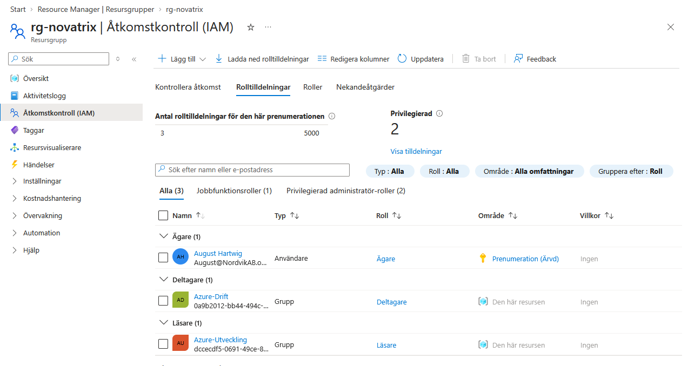

# V.35 Novatrix, IAM och identitet

**Repo: https://github.com/00aughar/azure-Mov25.git**

**August Hartwig** 
**MOV25** 
**1/9**

# 1. Skapa användare i Azure portalen via Entra.

Skapade dedikerade användarkonton i Microsoft Entra ID avsedda för rollbaserad testning och åtkomststyrning, i stället för att använda vanliga personliga konton.

# 2. Skapa säkerhetsgrupp i azure portalen via Entra

Skapade säkerhetsgrupperna *Azure-Drift* och *Azure-Utveckling* i Entra ID för att möjliggöra gruppbaserad behörighetsstyrning.

# 3. RBAC, behörighet & scope

Tilldela roll till säkerhetsgrupp och sätt scope på vilka resursgrupper som ska styras av medlemmarna. Tillämpa least priviledge.

- Drift *"Azure-Drift"* avdelningen har *Contributor* behörighet på resursgrupp *rg-novatrix*. Motivering: Ansvarar för drift, uppbyggnad och underhåll av infrastrukturen.

- Utveckling *"Azure-Utveckling"* avdelningen har *Reader* behörighet på resursgrupp *rg-novatrix*. Motivering: Behöver enbart insyn och möjlighet att övervaka miljön.

Reslutat:



# 4. Verifiering av RBAC

1. Verifiering via Azure portalen. Gå till resursen i azure portalen och access control kontrollerar jag avdelningskontot för båda användarna. Där får jag en överblick på vilken rolltildening dem har och att dem tillhör grupptilldelningen.

Reslutat:


2. Loggade in med respektive konto för att verifiera att behörighetsbegränsningarna tillämpas i praktiken (t.ex. att start/stopp av VM nekas för utvecklarkontot men tillåts för driftkontot).

Reslutat:


# 5. Skapa Managed Identity

Skapade en managed identity i resursgruppen *rg-novatrix*. Denna förbereds för framtida lösenordsfri autentisering mot Azure Storage i kommande utveckling av Novatrix formulärapplikation.


# 6. Challenge

Scriptet "rbac-novatrix.sh" automatiserar rolltildeningen (RBAC) för Novatrix miljön via Azure CLI. Med scriptet slipper jag bygga upp behörighetsstrukturen via manuella steg och gör att miljön blir repoducerbar.

Scriptet förutsätter att konton & säkerhetsgrupper är skapade i Azure miljön sedan tidigare. Scriptet körs i en Azure CLI ansluten git bash terminal eller direkt via cloud shell genom Azure miljön.

Scriptet delas upp i följande steg:

1. Definera variabler som används. Här har vi resursgruppen som grupperna ska tilldelas behörighet till. Prenumerations ID defineras.

```
RESOURCE_GROUP="rg-novatrix"
DRIFT_GROUP="Novatrix-Drift"
DEV_GROUP="Novatrix-Utveckling"
SUBSCRIPTION_ID="c65a0fbb-a7a6-42f1-8743-0e248b213c2c"
``` 

2. Scopet hämtas genom att ta fram ID på resursgruppen som ska tilldeas behörigheter för resursgrupperna.

```
RG_ID=$(az group show --name "$RESOURCE_GROUP" --query id -o tsv)
```

3. Unikt ID på säkerhetsgrupperna hämtas från Entra ID. *"Novatrix-Drift"* & *"Novatrix-Utveckling"* 

```
DRIFT_GROUP_ID=$(az ad group show --group "$DRIFT_GROUP" --query id -o tsv)
DEV_GROUP_ID=$(az ad group show --group "$DEV_GROUP" --query id -o tsv)

```

4. RBAC tilldelning på resursgruppen *"rg-novatrix"*.

- *Novatrix-Drift* tilldelas *Contributor* för att kunna utföra nödvändigt underhåll av resurserna i resursgruppen. Exempelvis hantera, starta & konfigurera resurserna, men inte hantera andras behörigheter. Endast Owner får göra detta.

- *Novatrix-Utveckling* tilldelas *Reader* för att kunna granska statusen, nätverkskonfigurationen & loggar på resurserna utan att riskera att oavsiktliga ändringar eller driftstörningar görs. 

```
az role assignment create \
  --assignee-object-id "$DRIFT_GROUP_ID" \
  --assignee-principal-type Group \
  --role "Contributor" \
  --scope "$RG_ID"

az role assignment create \
  --assignee-object-id "$DEV_GROUP_ID" \
  --assignee-principal-type Group \
  --role "Reader" \
  --scope "$RG_ID"
```

Motviering till least privledge modellen:

- Rolltildelning via säkerhetsgrupper istället för användare gör att miljön blir enklare att skala upp i framtiden. Det blir säkrare och översynen blir tydligare. Börjar en ny medarbetare läggs denna till i säkerhetsgruppen som redan har tilldelats RBAC behörigheter. Slutar en användare tas den bort från gruppen och behörigheterna försvinner.
- Behörighetsuppdelning baserat på avdelningens syfte och arbetsflöde. Exempelvis utvecklingsavdelningen *Novatrix-Utveckling* har endast *Reader* behörighet. Avdelningens syfte är inte underhåll av resurser utan utveckling av applikationer i verksamheten. *Novatrix-Drift* har *Contributor* behörighet då dem jobbar med underhåll av resurserna och behöver ha åtkomst till verktyg som starta & konfigurera resurser. 
- Ingen av avdelningarna tilldelas *Owner*. Det begränsar skadeverkan betydligt om ett konto skulle bli komprometterat, eftersom en angripare inte kan dela ut nya rättigheter eller ta över hela tenanten.


Resultat:


