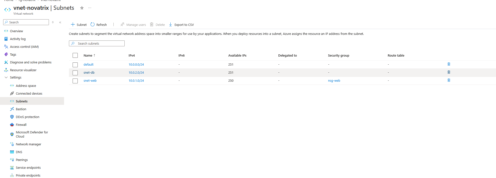
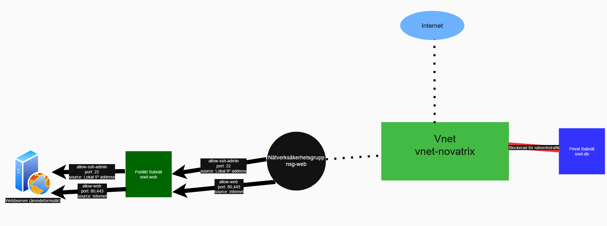

# V.36 Nätverk och säkerhet

**Repo: https://github.com/00aughar/azure-Mov25.git**

**August Hartwig** 
**MOV25** 
**x/x**

1. Skapa ett VNET

Via Azure portalen navigerar jag till virtuella nätverk. Skapar ett nytt virtuellt nätverk för nätverksresursen *rg-novatrix* som jag döper till *vnet-novatrix* i regionen *Sweden Central*.

Syftet med VNET är att kunna skapa en isolerad och kontrollerad miljö där servrar och resurser blir mindre exponerade mot internet.

2. Skapa subnäten

Navigera till *vnet-novatrix* och välja subnät. Skapa nytt subnät.


- *snet-web* för subnät till webserver
- *snet-db* för databas och lagring



Syftet är att skydda nätverkets olika delar genom segmentering. Uppdelningen görs med tydlig namngiving på vilken roll inom nätverket subnätet har.

3. Skapa nätverksäkerhetsgrupper (NSG) 

Portar öppnas med tankesättet Least Privledge. Minsta möjliga antal portar som behövs öppnas baserat på att dem fyller en funktion. 

Via Azure portalen navigera till Network securit groups och skapa en security group. Säkerhetsgruppen gäller för resursgrupp *rg-novatrix* och heter *nsg-web*.

Navigera till säkerhetsgruppen *nsg-web* och välj "Inbound security rules" och lägger till:
- *allow-web* Tillåt inkommande trafik på portar *80* och *443* för web trafik
- *allow-ssh-admin* Tillåt inkommande trafik på port *22* endast från min lokala IP-address


4. Koppla NSG till subnätet

Navigera till säkerhetsgruppen *nsg-web* och koppla till *vnet-novatrix* subnät *snet-web*. När säkerhetsgruppen är kopplad till det virtuella nätverket slår det in även på subnäten. 


5. Placera VM i rätt subnät

Navigera till den virutella maskinen *vm-novatrix-web* och se till att den är avstängd för att skapa en snapshot av maskinens hårddisk. Därefter ta bort den virutella maskinen för att starta upp en ny virtuell maskin med snapshoten.

När den nya virtuella maskinen skapas välj att nätverkskortet (NIC) är låst till rätt vnet *vnet-novatrix* 

6. Verifiera att SSH följer NSG regler

Via Azure Portalen navigera till Network Watcher > IP flow verify. Testa trafiken via en okänd IP address för att testa NSG regel *allow-ssh-admin* på port *22* blir nekad.


7. Skiss Nätverksdesign & NSG Tabell




| Regel | Riktning | Källa | Port | Åtgärd | Motivering |
|---|---|---|---|---|---|
| allow-web | Inbound | Internet | 80, 443 | Allow | Formuläret ska vara publikt nåbart |
| allow-ssh-admin | Inbound | Lokal IP-adress | 22 | Allow | Endast administratör ska kunna hantera VM:en |
| deny-all-inbound | Inbound | Any | Any | Deny | Explicit stäng allt annat |


8. Challenge

Skriptet *deploy-network.sh* skapar ett segmenterat virtuellt nätverk *vnet-novatrix* som består av de tre subnäten *snet-web*, *snet-db* och *snet-admin*. Varje subnät skyddas av en dedikerad säkerhetsgrupp *nsg-web*, *nsg-db* respektive *nsg-admin*.

Lösningen etablerar en säkrad hoppvärdsarkitektur där all extern SSH-trafik styrs direkt till hoppvärden *vm-novatrix-admin* (i *snet-admin*). Därifrån kan behörig administrativ trafik vidarebefordras internt till målservern *vm-novatrix-web* (i *snet-web*), medan direktanslutningar utifrån mot det interna nätverket blockeras helt.

1. Variabler klarrgör namngivning, plats, prefix & resursgrupp inom scriptet.

``` SUBSCRIPTION_ID="c65a0fbb-a7a6-42f1-8743-0e248b213c2c"
RESOURCE_GROUP="rg-novatrix-test"
LOCATION="swedencentral"
VNET_NAME="vnet-novatrix"
VNET_PREFIX="10.20.0.0/16"
LOCAL_IP="FYLL I PUBLIK IP HÄR"

SUBNET_WEB="snet-web"
SUBNET_WEB_PREFIX="10.20.1.0/24"

SUBNET_DB="snet-db"
SUBNET_DB_PREFIX="10.20.2.0/24"

SUBNET_ADMIN="snet-admin"
SUBNET_ADMIN_PREFIX="10.20.3.0/24"

NSG_WEB="nsg-web"
NSG_DB="nsg-db"
NSG_ADMIN="nsg-admin"

```
2. Skapande av Vnet och subnätet *snet-web*

```
az network vnet create \
  --resource-group "$RESOURCE_GROUP" \
  --name "$VNET_NAME" \
  --address-prefix "$VNET_PREFIX" \
  --subnet-name "$SUBNET_WEB" \
  --subnet-prefix "$SUBNET_WEB_PREFIX" \
  --location "$LOCATION"
```

3. Skapande av subnäten *nsg-db* för lagrning och *nsg-admin* för hoppvärden.

```
az network vnet subnet create \
  --resource-group "$RESOURCE_GROUP" \
  --vnet-name "$VNET_NAME" \
  --name "$SUBNET_DB" \
  --address-prefix "$SUBNET_DB_PREFIX"

az network vnet subnet create \
  --resource-group "$RESOURCE_GROUP" \
  --vnet-name "$VNET_NAME" \
  --name "$SUBNET_ADMIN" \
  --address-prefix "$SUBNET_ADMIN_PREFIX"

  ```

 4. Skapande av NSG regler

  ```
  az network nsg create --resource-group "$RESOURCE_GROUP" --name "$NSG_WEB" --location "$LOCATION"
az network nsg create --resource-group "$RESOURCE_GROUP" --name "$NSG_DB" --location "$LOCATION"
az network nsg create --resource-group "$RESOURCE_GROUP" --name "$NSG_ADMIN" --location "$LOCATION"
```

5. Konfiguration av NSG regler. Portar, protkokoll, prioritet

```
echo "5. Konfigurerar nsg-web..."
az network nsg rule create \
  --resource-group "$RESOURCE_GROUP" --nsg-name "$NSG_WEB" \
  --name allow-web --priority 100 \
  --direction Inbound --access Allow --protocol Tcp \
  --destination-port-ranges 80 443 \
  --source-address-prefixes Internet

az network nsg rule create \
  --resource-group "$RESOURCE_GROUP" --nsg-name "$NSG_WEB" \
  --name allow-ssh-from-admin --priority 110 \
  --direction Inbound --access Allow --protocol Tcp \
  --destination-port-ranges 22 \
  --source-address-prefixes "$SUBNET_ADMIN_PREFIX"

    echo "Konfigurerar nsg-admin..."
az network nsg rule create \
  --resource-group "$RESOURCE_GROUP" \
  --nsg-name "$NSG_ADMIN" \
  --name "allow-ssh-myip" \
  --priority 100 \
  --direction Inbound \
  --access Allow \
  --protocol Tcp \
  --destination-port-ranges 22 \
  --source-address-prefixes "$LOCAL_IP"


# 6. NSG-regler för Databas (snet-db)
echo "6. Konfigurerar nsg-db..."
az network nsg rule create \
  --resource-group "$RESOURCE_GROUP" --nsg-name "$NSG_DB" \
  --name allow-web-to-db --priority 100 \
  --direction Inbound --access Allow --protocol Tcp \
  --destination-port-ranges 3306 5432 \
  --source-address-prefixes "$SUBNET_WEB_PREFIX"

az network nsg rule create \
  --resource-group "$RESOURCE_GROUP" --nsg-name "$NSG_DB" \
  --name allow-ssh-from-admin --priority 110 \
  --direction Inbound --access Allow --protocol Tcp \
  --destination-port-ranges 22 \
  --source-address-prefixes "$SUBNET_ADMIN_PREFIX"

az network nsg rule create \
  --resource-group "$RESOURCE_GROUP" --nsg-name "$NSG_DB" \
  --name deny-internet-all --priority 200 \
  --direction Inbound --access Deny --protocol '*' \
  --destination-port-ranges '*' \
  --source-address-prefixes Internet
```

7. Koppla NSGer till subnäten

```

az network vnet subnet update --resource-group "$RESOURCE_GROUP" --vnet-name "$VNET_NAME" --name "$SUBNET_WEB" --network-security-group "$NSG_WEB"
az network vnet subnet update --resource-group "$RESOURCE_GROUP" --vnet-name "$VNET_NAME" --name "$SUBNET_DB" --network-security-group "$NSG_DB"
az network vnet subnet update --resource-group "$RESOURCE_GROUP" --vnet-name "$VNET_NAME" --name "$SUBNET_ADMIN" --network-security-group "$NSG_ADMIN"

```