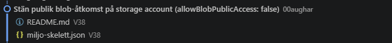
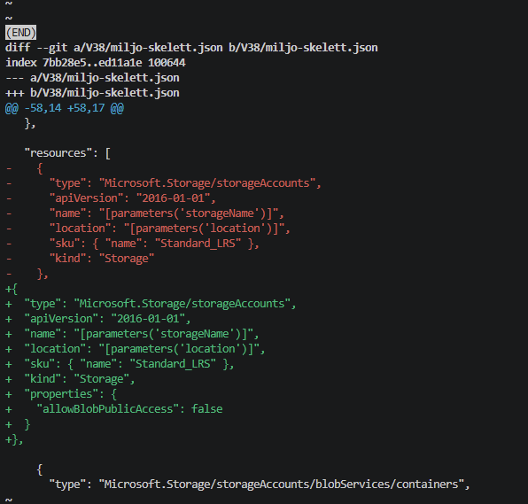

# V.38 IaC

**Repo: https://github.com/00aughar/azure-Mov25.git**

**August Hartwig** 
**MOV25** 
**22/9**


För godkänt började jag med template mallen *miljo-skelett.json* och byggde upp strukturen där en NSG med öppen webbregel för port 80 & 443, VNEt & subnät samt ett storage account. Namn och region gjorde som parametrar.

```
{
  "$schema": "https://schema.management.azure.com/schemas/2019-04-01/deploymentTemplate.json#",
  "contentVersion": "1.0.0.0",
  "metadata": {
    "note": "SKELETT att bygga vidare i. Strukturen finns, men resources ar tom med flit. Fyll i sjalv. Att gora (G): en NSG med en webbregel (portar 80 och 443), ett VNet med ett subnat, och ett storage account. For VG: lagg till en VM och koppla ihop resurserna med dependsOn. Titta i de enkla exempelfilerna for monstret: varje resurs har type, apiVersion, name, location och properties. Parametrarna har defaultvarden, sa du kan deploya direkt med: az deployment group create -g rg-novatrix --template-file miljo-skelett.json (eller gor en egen parameterfil nar du vill styra vardena)."
  },
  
  "parameters": {
    "namePrefix": {
      "type": "string",
      "defaultValue": "novatrix",
      "metadata": { "description": "Prefix for alla resursnamn, sa att allt hanger ihop." }
    },
    "location": {
      "type": "string",
      "defaultValue": "swedencentral",
      "metadata": { "description": "Region for resurserna." }
    },
      "storageName": {
    "type": "string",
    "metadata": { "description": "Globalt unikt namn, endast gemener och siffror, max 24 tecken." }
  }
  },
  "variables": {
  "nsgWebName": "[concat('nsg-', parameters('namePrefix'), '-web')]",
  "vnetName": "[concat('vnet-', parameters('namePrefix'))]",
  "subnetWebName": "snet-web",
  "subnetWebPrefix": "10.20.1.0/24",
  "vnetPrefix": "10.20.0.0/16"
  },
  "resources": [
        {
      "type": "Microsoft.Storage/storageAccounts",
      "apiVersion": "2016-01-01",
      "name": "[parameters('storageName')]",
      "location": "[parameters('location')]",
      "sku": { "name": "Standard_LRS" },
      "kind": "Storage"
    }
    ,
    {
  "type": "Microsoft.Network/networkSecurityGroups",
  "apiVersion": "2017-06-01",
  "name": "[variables('nsgWebName')]",
  "location": "[parameters('location')]",
  "properties": {
    "securityRules": [
      {
        "name": "allow-web",
        "properties": {
          "priority": 100,
          "direction": "Inbound",
          "access": "Allow",
          "protocol": "Tcp",
          "sourceAddressPrefix": "Internet",
          "sourcePortRange": "*",
          "destinationAddressPrefix": "*",
          "destinationPortRanges": ["80", "443"]
        }
      }
    ]
  }
}
,
{
  "type": "Microsoft.Network/virtualNetworks",
  "apiVersion": "2017-06-01",
  "name": "[variables('vnetName')]",
  "location": "[parameters('location')]",
  "dependsOn": [
    "[resourceId('Microsoft.Network/networkSecurityGroups', variables('nsgWebName'))]"
  ],
  "properties": {
    "addressSpace": {
      "addressPrefixes": ["[variables('vnetPrefix')]"]
    },
    "subnets": [
      {
        "name": "[variables('subnetWebName')]",
        "properties": {
          "addressPrefix": "[variables('subnetWebPrefix')]",
          "networkSecurityGroup": {
            "id": "[resourceId('Microsoft.Network/networkSecurityGroups', variables('nsgWebName'))]"
          }
        }
      }
    ]
  }
}

  ],
  "outputs": {
  }
}
```


Testa template med what-if:

```
az deployment group what-if --resource-group rg-novatrix --template-file miljo-skelett.json
```


Deploya template:

```
az deployment group create \
  --resource-group rg-novatrix \
  --template-file miljo-skelett.json
```


Kontrollera resurser i resursgrupp:

```
az resource list --resource-group rg-novatrix -o table
```


# IaC Challenge


## Beskrivning av Template, paramterar & cloud-init

ARM template *miljo-skelett.json* provisionerar: storage account + blob container, NSG med SSH & web regler, VNet + subnät, Publik-IP + NIC och en VM med webformulär.

Parameter filen *miljo-skelett.parameters.json* definerar parmetetrar som är unika beroende på hur miljön ska byggas upp och körs ihop med ARM template *miljo-skelett.json*.

VM Webservern byggs upp med *cloud-init.txt* som gör att ärendeformulär kan tas emot och lagras i blob storage.

## Förberedelser innan användning av template

För att templaten ska fungera behövs värden fyllas i inom parameter filen *miljo-skelett.parameters.json*. 

sshPublicKey definerar det publika nyckelvärdet som behövs för att ansluta till webservern via SSH och ett nyckelpar kan behövs skapas innan med kommando: ```ssh-keygen -t rsa -b 4096 -f ~/novatrix-v38-key -N ""```

cloudInitWebServer gör att konfigurationsfilen blir läsbar för Azure och kan läsas in för webserverns konfiguration. En ändring behövs även göras i cloud-init.txt filen på raden som börjar med *STORAGE_ACCOUNT = "NAMN"*  som definerar lagringens namngivning.

adminIp ger värdet på den lokala IP adressen. Värdet behövs för att NSG regeln för SSH ska godkänna anslutning till webserven.

```   
"sshPublicKey": { "value": "FYLL I VÄRDET FRÅN TERMINAL: ssh-keygen -y -f ~/novatrix-v38-key" },

"cloudInitWebServer": { "value": "FYLL I VÄRDET FRÅN TERMINAL: base64 -w 0 cloud-init.txt" },

"adminIp": { "value": "FYLL I VÄRDET FRÅN TERMINAL: curl ifconfig.me" },
```

## Körning av Template

När nödvändiga template värden, SSH nyckel har genererats och cloud-init.txt redigerats för miljön kan template deployas. En resursgrupp måste finnas innan om den inte har skapats upp.

## 1. Skapa resursgruppen (om den inte redan finns)
```  
az group create --name rg-novatrix --location swedencentral
```  

## 2. Deploya templaten
```  
az deployment group create \
  --resource-group rg-novatrix \
  --template-file miljo-skelett.json \
  --parameters @miljo-skelett.parameters.json
```  
## ARM templatens innehåll

```

  {
  "$schema": "https://schema.management.azure.com/schemas/2019-04-01/deploymentTemplate.json#",
  "contentVersion": "1.0.0.0",
  "metadata": {
    "note": "SKELETT att bygga vidare i. Strukturen finns, men resources ar tom med flit. Fyll i sjalv. Att gora (G): en NSG med en webbregel (portar 80 och 443), ett VNet med ett subnat, och ett storage account. For VG: lagg till en VM och koppla ihop resurserna med dependsOn. Titta i de enkla exempelfilerna for monstret: varje resurs har type, apiVersion, name, location och properties. Parametrarna har defaultvarden, sa du kan deploya direkt med: az deployment group create -g rg-novatrix --template-file miljo-skelett.json (eller gor en egen parameterfil nar du vill styra vardena)."
  },

  "parameters": {
    "namePrefix": {
      "type": "string",
      "defaultValue": "novatrix",
      "metadata": { "description": "Prefix for alla resursnamn, sa att allt hanger ihop." }
    },
    "location": {
      "type": "string",
      "defaultValue": "swedencentral",
      "metadata": { "description": "Region for resurserna." }
    },
    "storageName": {
      "type": "string",
      "metadata": { "description": "Globalt unikt namn, endast gemener och siffror, max 24 tecken." }
    },
    "cloudInitWebServer": {
      "type": "string",
      "metadata": { "description": "Base64-kodad cloud-init som bygger upp arendeappen." }
    },
    "sshPublicKey": {
      "type": "string",
      "metadata": { "description": "Din publika SSH-nyckel (t.ex. fran novatrix-admin_key.pub)." }
    },
    "adminUsername": {
      "type": "string",
      "defaultValue": "azureuser"
    },
    "adminIp": {
      "type": "string",
      "metadata": { "description": "Din publika IP (t.ex. fran curl ifconfig.me) for SSH-atkomst." }
    },
  "vmSize": {
  "type": "string",
  "defaultValue": "Standard_D2als_v6",
  "metadata": { "description": "VM-storlek. Kontrollera kvot med: az vm list-usage --location swedencentral" }
}
    
  },

  "variables": {
    "nsgWebName": "[concat('nsg-', parameters('namePrefix'), '-web')]",
    "vnetName": "[concat('vnet-', parameters('namePrefix'))]",
    "subnetWebName": "snet-web",
    "subnetWebPrefix": "10.20.1.0/24",
    "vnetPrefix": "10.20.0.0/16",
    "vmWebName": "[concat('vm-', parameters('namePrefix'), '-web')]",
    "pipWebName": "[concat('pip-', variables('vmWebName'))]",
    "nicWebName": "[concat('nic-', variables('vmWebName'))]",
    "containerName": "arenden",
    "blobContributorRoleId": "[subscriptionResourceId('Microsoft.Authorization/roleDefinitions', 'ba92f5b4-2d11-453d-a403-e96b0029c9fe')]"
  },

  "resources": [
{
  "type": "Microsoft.Storage/storageAccounts",
  "apiVersion": "2016-01-01",
  "name": "[parameters('storageName')]",
  "location": "[parameters('location')]",
  "sku": { "name": "Standard_LRS" },
  "kind": "Storage",
  "properties": {
    "allowBlobPublicAccess": false
  }
},

    {
      "type": "Microsoft.Storage/storageAccounts/blobServices/containers",
      "apiVersion": "2023-01-01",
      "name": "[concat(parameters('storageName'), '/default/', variables('containerName'))]",
      "dependsOn": [
        "[resourceId('Microsoft.Storage/storageAccounts', parameters('storageName'))]"
      ],
      "properties": {
        "publicAccess": "None"
      }
    },

    {
      "type": "Microsoft.Network/networkSecurityGroups",
      "apiVersion": "2017-06-01",
      "name": "[variables('nsgWebName')]",
      "location": "[parameters('location')]",
      "properties": {
        "securityRules": [
          {
            "name": "allow-web",
            "properties": {
              "priority": 100,
              "direction": "Inbound",
              "access": "Allow",
              "protocol": "Tcp",
              "sourceAddressPrefix": "Internet",
              "sourcePortRange": "*",
              "destinationAddressPrefix": "*",
              "destinationPortRanges": ["80", "443"]
            }
          },
          {
            "name": "allow-ssh-myip",
            "properties": {
              "priority": 110,
              "direction": "Inbound",
              "access": "Allow",
              "protocol": "Tcp",
              "sourceAddressPrefix": "[parameters('adminIp')]",
              "sourcePortRange": "*",
              "destinationAddressPrefix": "*",
              "destinationPortRange": "22"
            }
          }
        ]
      }
    },

    {
      "type": "Microsoft.Network/virtualNetworks",
      "apiVersion": "2017-06-01",
      "name": "[variables('vnetName')]",
      "location": "[parameters('location')]",
      "dependsOn": [
        "[resourceId('Microsoft.Network/networkSecurityGroups', variables('nsgWebName'))]"
      ],
      "properties": {
        "addressSpace": {
          "addressPrefixes": ["[variables('vnetPrefix')]"]
        },
        "subnets": [
          {
            "name": "[variables('subnetWebName')]",
            "properties": {
              "addressPrefix": "[variables('subnetWebPrefix')]",
              "networkSecurityGroup": {
                "id": "[resourceId('Microsoft.Network/networkSecurityGroups', variables('nsgWebName'))]"
              }
            }
          }
        ]
      }
    },

    {
      "type": "Microsoft.Network/publicIPAddresses",
      "apiVersion": "2023-05-01",
      "name": "[variables('pipWebName')]",
      "location": "[parameters('location')]",
      "sku": { "name": "Standard" },
      "properties": { "publicIPAllocationMethod": "Static" }
    },

    {
      "type": "Microsoft.Network/networkInterfaces",
      "apiVersion": "2023-05-01",
      "name": "[variables('nicWebName')]",
      "location": "[parameters('location')]",
      "dependsOn": [
        "[resourceId('Microsoft.Network/virtualNetworks', variables('vnetName'))]",
        "[resourceId('Microsoft.Network/publicIPAddresses', variables('pipWebName'))]"
      ],
      "properties": {
        "ipConfigurations": [
          {
            "name": "ipconfig1",
            "properties": {
              "subnet": {
                "id": "[resourceId('Microsoft.Network/virtualNetworks/subnets', variables('vnetName'), variables('subnetWebName'))]"
              },
              "publicIPAddress": {
                "id": "[resourceId('Microsoft.Network/publicIPAddresses', variables('pipWebName'))]"
              }
            }
          }
        ]
      }
    },

    {
      "type": "Microsoft.Compute/virtualMachines",
      "apiVersion": "2023-09-01",
      "name": "[variables('vmWebName')]",
      "location": "[parameters('location')]",
      "identity": { "type": "SystemAssigned" },
      "dependsOn": [
        "[resourceId('Microsoft.Network/networkInterfaces', variables('nicWebName'))]"
      ],
      "properties": {
        "hardwareProfile": { "vmSize": "[parameters('vmSize')]" },
        "osProfile": {
          "computerName": "[variables('vmWebName')]",
          "adminUsername": "[parameters('adminUsername')]",
          "customData": "[parameters('cloudInitWebServer')]",
          "linuxConfiguration": {
            "disablePasswordAuthentication": true,
            "ssh": {
              "publicKeys": [
                {
                  "path": "[concat('/home/', parameters('adminUsername'), '/.ssh/authorized_keys')]",
                  "keyData": "[parameters('sshPublicKey')]"
                }
              ]
            }
          }
        },
        "storageProfile": {
          "imageReference": {
            "publisher": "Canonical",
            "offer": "ubuntu-24_04-lts",
            "sku": "server",
            "version": "latest"
          },
          "osDisk": {
            "createOption": "FromImage",
            "managedDisk": { "storageAccountType": "Standard_LRS" }
          }
        },
        "networkProfile": {
          "networkInterfaces": [
            { "id": "[resourceId('Microsoft.Network/networkInterfaces', variables('nicWebName'))]" }
          ]
        }
      }
    },

    {
      "type": "Microsoft.Authorization/roleAssignments",
      "apiVersion": "2022-04-01",
      "scope": "[concat('Microsoft.Storage/storageAccounts/', parameters('storageName'), '/blobServices/default/containers/', variables('containerName'))]",
      "name": "[guid(resourceGroup().id, parameters('storageName'), variables('containerName'), variables('vmWebName'))]",
      "dependsOn": [
        "[resourceId('Microsoft.Storage/storageAccounts/blobServices/containers', parameters('storageName'), 'default', variables('containerName'))]",
        "[resourceId('Microsoft.Compute/virtualMachines', variables('vmWebName'))]"
      ],
      "properties": {
        "roleDefinitionId": "[variables('blobContributorRoleId')]",
        "principalId": "[reference(resourceId('Microsoft.Compute/virtualMachines', variables('vmWebName')), '2023-09-01', 'full').identity.principalId]",
        "principalType": "ServicePrincipal"
      }
    }
  ],

  "outputs": {
    "webserverPublikIp": {
      "type": "string",
      "value": "[reference(resourceId('Microsoft.Network/publicIPAddresses', variables('pipWebName'))).ipAddress]"
    },
    "storageAccountNamn": {
      "type": "string",
      "value": "[parameters('storageName')]"
    }
  }
}
```

## Parameter filens innehåll

```
{
  "$schema": "https://schema.management.azure.com/schemas/2015-01-01/deploymentParameters.json#",
  "contentVersion": "1.0.0.0",
  "parameters": {
    "namePrefix": { "value": "novatrix" },
    "location": { "value": "swedencentral" },
    "storageName": { "value": "VÄLJ UNIKT NAMN FÖR LAGRING: stnovatrixXXX" },
    "adminUsername": { "value": "azureuser" },
    "sshPublicKey": { "value": "FYLL I VÄRDET FRÅN TERMINAL: ssh-keygen -y -f ~/novatrix-v38-key" },
    "cloudInitWebServer": { "value": "FYLL I VÄRDET FRÅN TERMINAL: base64 -w 0 cloud-init.txt" },
    "adminIp": { "value": "FYLL I VÄRDET FRÅN TERMINAL: curl ifconfig.me" },
    "vmSize": { "value": "Standard_D2als_v6" }
  }
}
```

## Versionshantering övning

För att öva på versionshantering gjorde jag en ändring i templaten. Då jag upptäckte att mitt storage account fortsatt var publik ladde jag till kod *"allowBlobPublicAccess": false*. Med en tydlig beskrivning av vad ändringen gjorde får jag en spårbarhet i koden som gör det lättare för andra att se vilka ändringar som jag har gjort. Det underlättar även ifall ifall det skulle börja orsaka några problem vid nästa körning av templaten då jag kan spåra bakåt vad felet kan bero på. Nedan syns tydligt vad som ändrades vid commit i koden och tillhörande meddelande.




## Reslutat av körning & verifiering

En what-if gjorde innan körning av templaten:


Komplett körning av template:


Kontrollera skapade resurser:


Webb formulär uppe:


Ifyllt och skickat formulär:


Mottaget formulär och blob:
