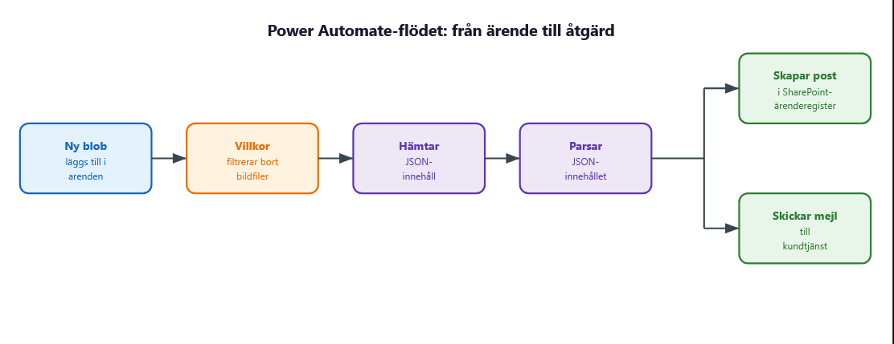

# V.37 Automation och integration

**Repo: https://github.com/00aughar/azure-Mov25.git**

**August Hartwig** 
**MOV25** 
**29/9**

Azure miljön byggs upp på liknande sätt som föregående vecka med IaC templaten *milo-skelett.json* och byggs ihop med parameterfilen *miljo-skelett.parameters*. Denna vecka används däremot en uppdaterad cloud-init.txt


#Flödesöversikt

Flödet bygger på triggern "When a blob is added or modified" och är kopplad till blob container *arenden* containern ligger inom storage account *stnovatrix652*.
Kommando för att hämta nyckel till storage account för att ansluta till flödets trigger:
```
az storage account keys list -g rg-novatrix -n stnovatrix652 --query "[0].value" -o tsv
```

Flödet bygger på triggern som hämtar värdena när ett nytt ärende skapas > Villkoret filtrerar ut ifall det är ett *arende-* & ifall det slutar på *.json* > JSON innehållet hämtas > Parsar JSON innehåller så värdena kan fyllas i till notis/lista > Skicka mailnotis till kundtjänst > Skapa ärenderegister i SharePoint.

