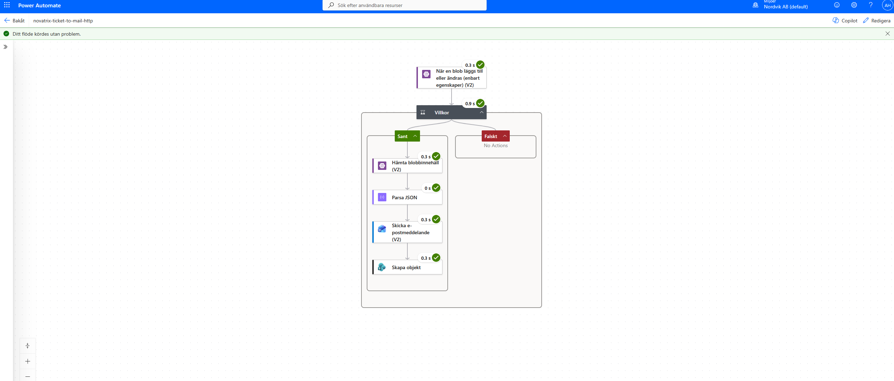
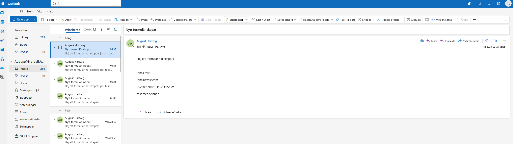

# V.39 Automation och integration

**Repo: https://github.com/00aughar/azure-Mov25.git**

**August Hartwig** 
**MOV25** 
**29/9**

Azure miljön byggs upp på liknande sätt som föregående vecka med IaC templaten *miljo-skelett.json* och byggs ihop med parameterfilen *miljo-skelett.parameters*. Denna vecka används däremot en uppdaterad cloud-init.txt


## Flödesöversikt

Flödet bygger på triggern "When a blob is added or modified" och är kopplad till blob container *arenden* containern ligger inom storage account *stnovatrix652*.
Kommando för att hämta nyckel till storage account för att ansluta till flödets trigger:
```
az storage account keys list -g rg-novatrix -n stnovatrix652 --query "[0].value" -o tsv
```

Flödets triggern som hämtar värdena när ett nytt ärende skapas > Villkoret filtrerar ut ifall filen börjar på värdet *arende-* & ifall det slutar på *.json* > JSON innehållet hämtas > Parsar JSON innehåller så värdena kan fyllas i till notis/lista > Skicka mailnotis till kundtjänst > Skapa ärenderegister i SharePoint.


Flödet

```
{
  "properties": {
    "connectionReferences": {
      "shared_azureblob-1": {
        "runtimeSource": "embedded",
        "connection": {
          "connectionReferenceLogicalName": "new_sharedazureblob_0601a"
        },
        "api": {
          "name": "shared_azureblob"
        }
      },
      "shared_office365": {
        "runtimeSource": "embedded",
        "connection": {
          "connectionReferenceLogicalName": "new_sharedoffice365_7d1fc"
        },
        "api": {
          "name": "shared_office365"
        }
      },
      "shared_sharepointonline": {
        "runtimeSource": "embedded",
        "connection": {
          "connectionReferenceLogicalName": "new_sharedsharepointonline_3acf8"
        },
        "api": {
          "name": "shared_sharepointonline"
        }
      }
    },
    "definition": {
      "$schema": "https://schema.management.azure.com/providers/Microsoft.Logic/schemas/2016-06-01/workflowdefinition.json#",
      "contentVersion": "1.0.0.0",
      "parameters": {
        "$authentication": {
          "defaultValue": {},
          "type": "SecureObject"
        },
        "$connections": {
          "defaultValue": {},
          "type": "Object"
        }
      },
      "triggers": {
        "När_en_blob_läggs_till_eller_ändras_(enbart_egenskaper)_(V2)": {
          "recurrence": {
            "interval": 1,
            "frequency": "Minute"
          },
          "splitOn": "@triggerOutputs()?['body']",
          "metadata": {
            "JTJmYXJlbmRlbg==": "/arenden"
          },
          "type": "OpenApiConnection",
          "inputs": {
            "parameters": {
              "dataset": "AccountNameFromSettings",
              "folderId": "JTJmYXJlbmRlbg=="
            },
            "host": {
              "apiId": "/providers/Microsoft.PowerApps/apis/shared_azureblob",
              "operationId": "OnUpdatedFiles_V2",
              "connectionName": "shared_azureblob-1"
            }
          }
        }
      },
      "actions": {
        "Villkor": {
          "actions": {
            "Hämta_blobbinnehåll_(V2)": {
              "type": "OpenApiConnection",
              "inputs": {
                "parameters": {
                  "dataset": "stnovatrix652",
                  "id": "@triggerOutputs()?['body/Path']",
                  "inferContentType": true
                },
                "host": {
                  "apiId": "/providers/Microsoft.PowerApps/apis/shared_azureblob",
                  "operationId": "GetFileContent_V2",
                  "connectionName": "shared_azureblob-1"
                }
              }
            },
            "Parsa_JSON": {
              "runAfter": {
                "Hämta_blobbinnehåll_(V2)": [
                  "Succeeded"
                ]
              },
              "type": "ParseJson",
              "inputs": {
                "content": "@base64ToString(body('Hämta_blobbinnehåll_(V2)')?['$content'])",
                "schema": {
                  "type": "object",
                  "properties": {
                    "id": {
                      "type": "string"
                    },
                    "name": {
                      "type": "string"
                    },
                    "mail": {
                      "type": "string"
                    },
                    "message": {
                      "type": "string"
                    },
                    "created": {
                      "type": "string"
                    },
                    "image": {
                      "type": "string"
                    }
                  }
                }
              }
            },
            "Skicka_e-postmeddelande_(V2)": {
              "runAfter": {
                "Parsa_JSON": [
                  "Succeeded"
                ]
              },
              "type": "OpenApiConnection",
              "inputs": {
                "parameters": {
                  "emailMessage/To": "August@NordvikAB.onmicrosoft.com",
                  "emailMessage/Subject": "Nytt formulär skapat",
                  "emailMessage/Body": "<p class=\"editor-paragraph\">Hej ett formulär har skapats</p><br><p class=\"editor-paragraph\">@{body('Parsa_JSON')?['name']}</p><p class=\"editor-paragraph\">@{body('Parsa_JSON')?['mail']}</p><p class=\"editor-paragraph\">@{body('Parsa_JSON')?['id']}</p><p class=\"editor-paragraph\">@{body('Parsa_JSON')?['message']}</p><br>",
                  "emailMessage/Importance": "Normal"
                },
                "host": {
                  "apiId": "/providers/Microsoft.PowerApps/apis/shared_office365",
                  "operationId": "SendEmailV2",
                  "connectionName": "shared_office365"
                }
              }
            },
            "Skapa_objekt": {
              "runAfter": {
                "Skicka_e-postmeddelande_(V2)": [
                  "Succeeded"
                ]
              },
              "type": "OpenApiConnection",
              "inputs": {
                "parameters": {
                  "dataset": "https://nordvikab.sharepoint.com/sites/NordvikFastigheterAB",
                  "table": "aae27410-4063-427c-8b1c-0249129a88f5",
                  "item/Title": "@body('Parsa_JSON')?['id']",
                  "item/Namn": "@body('Parsa_JSON')?['name']",
                  "item/Epost": "@body('Parsa_JSON')?['mail']",
                  "item/Meddelande": "@body('Parsa_JSON')?['message']",
                  "item/DatumSkapad": "@body('Parsa_JSON')?['created']",
                  "item/Bild": "@body('Parsa_JSON')?['image']"
                },
                "host": {
                  "apiId": "/providers/Microsoft.PowerApps/apis/shared_sharepointonline",
                  "operationId": "PostItem",
                  "connectionName": "shared_sharepointonline"
                }
              }
            }
          },
          "runAfter": {},
          "else": {
            "actions": {}
          },
          "expression": {
            "and": [
              {
                "contains": [
                  "@triggerOutputs()?['body/Path']",
                  "arende-"
                ]
              },
              {
                "endsWith": [
                  "@triggerOutputs()?['body/Path']",
                  ".json"
                ]
              }
            ]
          },
          "type": "If"
        }
      },
      "outputs": {}
    },
    "templateName": null
  },
  "schemaVersion": "1.0.0.0"
}
```

# Sharepoint design

Sharepointen 


# Motivering bakom designen

- Blob-trigger istället för webook. För att slippa göra kodänrigar i appen och upfylla uppgiftens syfte använde jag blob-triggern för att göra ett simpelt men fungerande flöde.
- Vilkorets filtrering på ```arende-+.json``` för att filtrera fram ärendedatan som behövs för notisen/listan. 
- Parsa JSON värden som "name", "mail", "message", "created" & "image" förs vidare i flödet för e-post meddelande och sharepoint listan *Ärenderegister*.

# Hur kedjan hade kunnat utökas

- Koppla med fler Microsoft tjänster exempelvis Teams för notiser.
- Bekräftelsemail till kunden när ett formulär har mottagits
- Statusuppdatering i Sharepoint listan. Exmeplvis *Nytt ärende*.
- Anpassa flödet för Bildhantering för att inkludera bilder i mailnotis/teams meddelanden. 


Resultat från labb:

Ifyllt formulär:


Flödet körs igenom:


Mailnotis skickat:


Sharepoint lista skapas:
