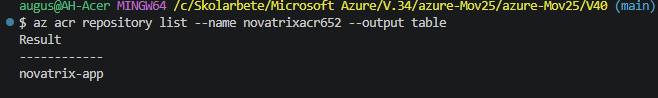

# V.40 Virtualiseringsnivåer

**Repo: https://github.com/00aughar/azure-Mov25.git**

**August Hartwig** 
**MOV25** 
**6/10**

# Formulär via container

Containern byggs upp via molnet via imagen *Dockerfile* i veckans repo. Filen har tre rader kod som förklaras nedan.


1. Anger image som ska utgås ifrån i detta fall nginx med alpine linuxdisturbition. 
2. Kopierar formulärsidan som finns i veckans repo *index.html*
3. Anger att containern ska lyssna på port 80 
```
FROM nginx:alpine

COPY index.html /usr/share/nginx/html/index.html

EXPOSE 80
```
## Körning av container

Skapa acr register i resursgrupp *rg-novatrix* och namnge till *novatrixacr652*.

```
az acr create --resource-group rg-novatrix --name novatrixacr652 --sku basic
```

## Bygg imagen i molnet
```
az acr build --registry novatrixacr652 --image novatrix-app:v1 .
```

## Verifiera
```
az acr repository list --name novatrixacr652 --output table
```


## Aktivera adminanvändare på ACR

```
az acr update --name novatrixacr652 --admin-enabled true
```

## Kör containern
```
ACR_PW=$(az acr credential show --name novatrixacr652 --query "passwords[0].value" -o tsv)

az container create --resource-group rg-novatrix --name novatrix-app \
  --image novatrixacr652.azurecr.io/novatrix-app:v1 \
  --os-type Linux --cpu 1 --memory 1 --ports 80 \
  --dns-name-label novatrix-app-652 \
  --registry-username novatrixacr652 --registry-password "$ACR_PW"
```

## Hämta addresen och besök formulärsidan

```
novatrix-app-652.swedencentral.azurecontainer.io
```

Resultat:


# Motivering

Virtualiseringsnivåerna

VM - Hög kontroll men mycket egen drift, egna skript och underhåll samt uppbyggnad av resurser. Tar längre tid att starta upp från grunden. Kostar hela tiden medans den är aktiv då den debiteras även när den är overksam.

Container - För en lätt & snabb driftsättning som är portabel. Formuläret tillgänglig för användare. Balans mellan självkontroll och ingen kontroll. Kostnaden baseras utifrån de allokerade resurser som används medans containern är aktiv, även ifall trafiken är låg eller inga ärenden skickas in. Däremot sparas kostnader för driftunderhåll då vi slipper hantera ett operativsystem på en VM.

Azure Functions Serverless - Ingen servern behövs och blir endast en tjänst uppbyggd på en funktion i kod som sedan körs i molnet. Azure ansvarar för underliggande infrastruktur, därav försvinner behovet av underhåll och drift och tjänsten blir enkel att hålla igång. Serverless kan ge en mer användningsbaserad kostnadsmodell där kostnaden bland annat påverkas av antal körningar och resursförbrukning, passar för tjänster som inte behöver nås konstant. Exempelvis skicka formuläret.

## Jämförselse och skillnader

| | VM | Container (ACI) | Serverless (Azure Function) |
|---|---|---|---|
| **Kort beskrivning** | En hel virtuell server med eget operativsystem | En paketerad image som körs utan eget operativsystem att sköta | Bara kod som körs när något anropar den |
| **Vad jag hanterar själv** | Operativsystem, patchning, SSH, installation av paket, konfiguration, appen | Imagen (Dockerfile), appen och registret | Själva koden |
| **Vad Azure hanterar** | Den fysiska maskinen och virtualiseringen | Servern och körmiljön under containern | Servrar, operativsystem, körmiljö och skalning |
| **Kostnadsmodell** | Betalar för kapacitet så länge den är igång, även när ingen använder den | Betalar per sekund för allokerad processor och minne så länge den kör | Betalar per körning, mer ekonomiskt om tjänsten inte används aktivt dygnet runt |
| **Skalning** | Byta storlek eller lägga till fler servrar | Skalar inte av sig själv, fler instanser måste startas | Azure Functions kan skala ut funktioner genom att starta fler instanser när belastningen ökar, beroende på vald hosting plan och dess skalningsfunktioner. |
| **Uppstart och driftsättning** | Långsammast, hela servern och resurser sätts upp med skript (`miljo-skelett.json`)(`miljo-skelett-parameters.json`) (`cloud-init`) | Bygger imagen en gång (`Dockerfile`) och startar den med ett kommando | Lägger upp koden, ingen server eller image |


En tydligt konkret exempel på skillnaden i hur uppbyggnad av webforumläret är mellan VM och Container är skillnaden i mängden kod om man jämför vecka 38 (IaC) moment med denna veckas Container kommando. Under IaC veckan behövdes VM installera paket, konfigrationsfiler och tjänster byggas upp samt resurser i kod på 471 rader medans denna vecka där samma formulär byggs upp med dockerfilen har 3 rader kod.


# VG

## Novatrix behov
För den här uppgiften väljer jag container eftersom Novatrix behöver en webbformulärssida som ska vara tillgänglig hela tiden. ACI ger en enkel och portabel lösning med betydligt mindre driftarbete än en VM. Däremot är själva mottagningen av ärendet händelsestyrd och lämpar sig bättre för Azure Functions. Därför skulle den mest optimerade produktionslösningen vara att kombinera container och serverless.

## Lösning val
Jag valde att använda en Container lösning för Novatrix behov. Formulärsidan körs i en container på Azure Container Instances (ACI) och byggs på en image *Dockerfile* i veckans repo. Jag har även byggt webbformuläret i en VM lösning med egen kod IaC. Container ger samma resultat för webformuläret men med betydligt mindre driftarbete/kod.

## Drift
Containern byggs upp en gång via imagen *Dockerfile* och driftsätts med kommandon som jag använt i denna veckans README dokumentation. Formulärsidan byggs upp och ligger sedan tillgänglig. Jag behöver inte underhålla operativsystem, patchning eller ssh. 

## Kostnad
Containern kostar likt VM baserat på allokerad processor och minnesanvändning. En aktiv container kostar oavsett om ingen besöker formulärsidan. Däremot sparar Container lösningen in på driftunderhållskostnader då inget operativsystem behöver underhållas. En serverless lösning hade kunnat vara mer befogad för formuläret beroende på hur trafikbesöken hade sett ut, en hög mängd besök hade också kunnat medföra en högre kostnad då man får betala för varje körning av tjänsten i serverless lösningen.

## Skalbarhet
En enskild Container skalar inte av sig själv. Om en högre belastning på webformuläret skulle inträffa hade fler instanser behövts startas eller en annan tjänst byggas upp. För Novatrix nuvarande behov i en testmiljö räcker en instans. 

## Optimering

En optimerad lösning är att kombinera nivåerna. Formulärsidan fortsätter att köras i en container, som är enkel att driftsätta och alltid nåbar. Mottagningen av ärendet flyttas till en serverless Azure Function som anropas när formuläret skickas in. Funktionen sparar ärendet i samma Blob-container som idag, så att Power Automate-flödet fortsätter fungera. På så sätt betalar jag för mottagningen bara när ett ärende kommer, och slipper hålla en server igång för den.

