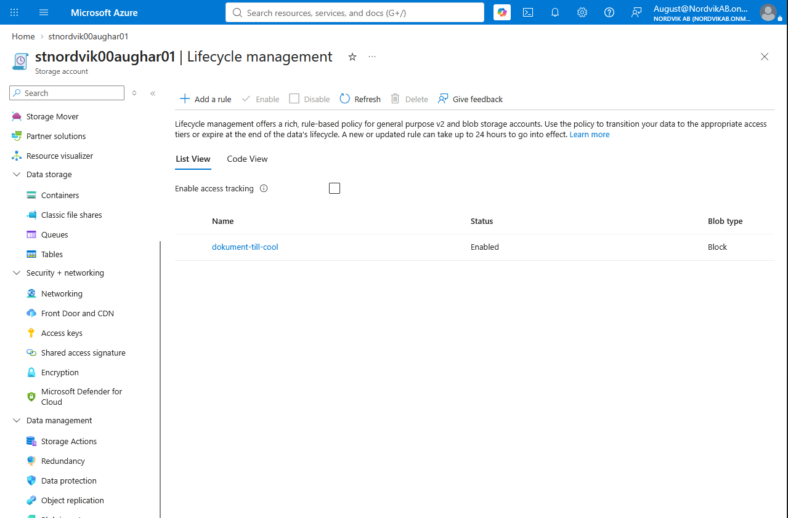

# V.41 Tenta

**Repo: https://github.com/00aughar/azure-Mov25.git**

**August Hartwig** 
**MOV25** 
**x/x**

Skapa resursgruppen
```
az group create --name rg-nordvik --location swedencentral
```

Skapa grupper förvaltare & ekonomi
```
az ad group create --display-name grp-nordvik-forvaltare --mail-nickname grp-nordvik-forvaltare
az ad group create --display-name grp-nordvik-ekonomi --mail-nickname grp-nordvik-ekonomi
```

Deploya
```
az group create --name rg-nordvik --location swedencentral \
  --tags foretag=nordvik projekt=hyresgastportal avdelning=forvaltning miljo=test

az deployment group validate --resource-group rg-nordvik \
  --template-file main.json --parameters @main.parameters.json

az deployment group what-if --resource-group rg-nordvik \
  --template-file main.json --parameters @main.parameters.json

az deployment group create --resource-group rg-nordvik --name nordvik-v1 \
  --template-file main.json --parameters @main.parameters.json
```

Del A, Dokumentation

Jag har implementerat portalen på en virtuell maskin. Valet bygger på kraven i fallet:

# Del A, Dokumentation

## 1. Centrala Azure-tjänster

| Område | Tjänst | Resurs i lösningen | Syfte |
|---|---|---|---|
| Compute | Virtuell maskin (IaaS) | `vm-nordvik-web` (Standard D2als v2, Ubuntu 24.04) | Kör formuläret och Flask-appen |
| Compute | Hanterad identitet | `id-nordvik-portal` | Ger appen åtkomst till lagringen utan nycklar |
| Nätverk | Virtuellt nätverk och subnät | `vnet-nordvik`, `snet-web` | Isolerat nätverk för VM:en |
| Nätverk | Nätverkssäkerhetsgrupp (NSG) | `nsg-nordvik-web` | Styr vilka portar och källor som når VM:en |
| Nätverk | Publik IP | `pip-nordvik-web` | Gör formuläret nåbart för hyresgäster |
| Storage | Blob Storage | `stnordvik00aughar01` med containrarna `anmalningar` och `dokument` | Lagrar anmälningar, bilder, kontrakt och protokoll |

Till detta kommer Entra ID för grupper och roller (RBAC) och ARM-mallar för att provisionera allt som kod. SharePoint, Teams, Outlook och Power Automate är SaaS-tjänster i Nordviks Microsoft 365 som Microsoft driftar helt. De ingår i helheten men inte i valet av virtualiseringsnivå.

## 2. Virtualiseringsnivåerna

| | Virtuell maskin | Container | Serverless |
|---|---|---|---|
| Azure-exempel | Virtual Machines | Container Instances, Container Apps | Azure Functions |
| Jag ansvarar för | Operativsystem, uppdateringar, runtime och app | Containerbild och app | Koden |
| Azure ansvarar för | Hårdvara och hypervisor | Värd och orkestrering | Allt under koden |
| Skalning | Manuell eller via skalningsgrupp | Snabb, kan skalas ut automatiskt | Automatisk per anrop, kan skalas till noll |
| Kostnadsmodell | Betalar så länge maskinen är allokerad | Betalar för körtid och resurser | Betalar per körning |
| Passar | Befintliga appar, full kontroll | Portabla, paketerade appar | Korta, händelsestyrda uppgifter |


## 3. Vald nivå för portalen: virtuell maskin

Jag har implementerat portalen på en virtuell maskin. Valet bygger på kraven i fallet och på mina förutsättningar.

### Last
Nordvik har 5 500 hyresgäster och cirka 1 800 inloggningar per dag, med toppar kl. 07-09 och 17-20 och ingen trafik kl. 00-06. Normalt är det 5-10 samtidiga användare och upp mot 120 vid topp, och vid en incident kan det komma över 300 anmälningar per timme. Det är en liten last som en liten VM klarar utan problem.

### Kostnad
En liten VM ryms med god marginal i ramen på cirka 2 500 kr per månad. I VM storleken Standard D2als v2 kostar $7,10 i månaden.

### Minst förändring och full kontroll
Appen körs som en vanlig tjänst och hela miljön byggs reproducerbart med ARM-mall och cloud-init. Jag behövde inte skriva om eller paketera om något.

### Kompetens och förvaltning
Jag kan bygga, felsöka och återskapa miljön som kod på VM-nivå. För en liten organisation är en lösning som går att förvalta ett värde i sig.

### Varför inte container eller serverless
Container och serverless hade flyttat driftansvaret till Azure och kunnat skalas ned till noll på natten. Men de hade krävt att appen paketerades om eller skrevs om till funktioner. Eftersom lasten är liten och jag ville behålla appen oförändrad valde jag VM-nivån.

## 4. Vad som inte uppnås med lösningen

- **Tillgänglighet (99,5 % under kontorstid och att tåla att en instans faller).** Portalen körs på en enda VM, som är en enda felpunkt. Om maskinen eller dess disk faller är portalen nere.
- **Ingen betalning för oanvänd kapacitet på natten.** En allokerad VM kostar dygnet runt, även mellan 00 och 06 när trafiken är noll.

## 5. Produktionsvariant: serverless

Den nivå som passar Nordviks krav bäst är serverless, till exempel Azure Functions med HTTP-triggers.

| Krav | VM (min implementation) | Serverless |
|---|---|---|
| Tåla att en instans faller | Nej | Ja, plattformen hanterar instanserna |
| Ingen betalning för oanvänd kapacitet | Nej | Ja, skalar till noll och faktureras per körning |
| Tillgänglighet | Enskild VM | Egen SLA för tjänsten

Lasten passar också: aktiviteten kommer i korta toppar och är noll på natten, vilket är det scenario där serverless betalar sig.

**Vad som skulle ändras:**
- Flask-appen skrivs om till funktioner. Formuläret kan återanvändas, men hanteringen av bilduppladdning måste anpassas.
- Mallen byts mot Function App, plan och ett subnät för VNet-integration. 

## 6. Slutsats

För Nordvik rekommenderar jag serverless i produktion. Jag valde VM för den här implementationen för att behålla appen oförändrad, visa hela miljön som kod och hålla nere risken, och jag redovisar ovan vad det kostar i krav som inte är uppfyllda.


Del B, Praktisk lösning
Planera och implementera infrastrukturen för hyresgästportalen med felanmälan:

Översikt

Webformulär > Blob Container > PowerAutomate flöde > Sharepoint lista > 


# Delmoment 1, Compute

Resursgrupp - *rg-nordvik*
VM - *vm-nordvik-web*


## Tjänsten och nivå val: 
Jag valde att bygga portalen på en virtuell maskin i Azure portalen *vm-nordvik-web*, Storlek *Standard D2als v2 (2 vcpus, 4 GiB memory)* med Operativsystemet *ubuntu-24_04-lts*. VMen är en IaaS tjänst, Azure sköter den fysiska hårdvaran medans jag sköter ansvar för operativsystemet, uppdateringar och applikationer. Jag valde VM lösningen för att lasten är låg med cirka 5-10 samtida användare med en topp vid 120. Hela miljön byggs upp med kod (IaC). Begränsningarna med denna lösning tas upp i del A.

## Konfigurationen:
 Maskinen konfigureras upp automatiskt med cloud-init filen *cloud-init-nordvik.txt* som skickas med i ARM-mallen *main.json* och tillhörande parameterfil *main.parameters.json*. Cloud-init filen konfigurerar Python bibliotken (flask, azure-identity och azure-storage-blob), lägger ut applikationen och registrerar den som tjänsten *felanmalan.service*. En ny VM blir därav identiskt konfigurerad om den behöver byggas upp igen, förutom det manuella steget för flödets address som näms nedan.

## Applikationen:
 Formuläret som innehåller fält för: rubrik, kategori, fastighet, beskrivning, bild, namn & e-post som sedan tas emot av flask-appen i bakrunden. När anmälan skickas sparar appen innehållet i en JSON-fil *arende-<id>.json* i blob container *anmalningar*, bifogade bilder sparas som en egen blob i containern. Appen anropar flödet för varje anmälan. Akuta kategorier (värme, vatten och lås) markeras med *urgent*, vilket flödet använder för att skicka ett direktmejl.

## Åtkomst till lagringen:
Applikationen använder den användartilldelade hanterade identiteten *id-nordvik-portal*, som har rollen *Storage Blob Data Contributor* på containern *anmalningar*. Därför finns inga nycklar eller lösenord i koden eller i repot. Flödets adress (FLOW_URL) är en hemlighet och lämnas tom i repot. Den sätts manuellt på VM:en efter uppstart.

## Bildbevis och test av tjänst

Formuläret:


Formulär ID:


Blobar mottagna:


JSON text blob:


# Delmoment 2, IAM

## Principen:
Rollerna följer least privilege. Varje identitet får lägsta möjliga rättighet, på lägsta möjliga nivå. Alla roller är därför tilldelade på containernivå och inte på hela lagringskontot, och tilldelas grupper i stället för enskilda personer. Det gör att en ny förvaltare bara behöver läggas till i en grupp. Grupperna *grp-nordvik-forvaltare* och *grp-nordvik-ekonomi* skapades i Entra ID, och deras object-ID:n skickas in som parametrar till mallen (forvaltareGroupId, ekonomiGroupId).

## Rollmodell

| Roll | Identitet | Azure-roll | Scope | Motivering |
|---|---|---|---|---|
| Hyresgäst | Ingen Azure-identitet | Ingen | – | Hyresgäster når aldrig lagringen direkt, utan skickar anmälningar via formuläret. Appen skriver åt dem. |
| Förvaltare | `grp-nordvik-forvaltare` | Storage Blob Data Contributor | `anmalningar` och `dokument` | Ska kunna läsa, skriva och hantera anmälningar och dokument. |
| Ekonomi | `grp-nordvik-ekonomi` | Storage Blob Data Reader | `anmalningar` och `dokument` | Läsande insyn utan rätt att ändra eller ladda upp. |
| Portalen | `id-nordvik-portal` (användartilldelad hanterad identitet) | Storage Blob Data Contributor | Endast `anmalningar` | Appen ska bara skriva anmälningar och bilder. Ingen åtkomst till `dokument`. |

## Hanterad identitet
Portalen använder en användartilldelad hanterad identitet i stället för nycklar. Nyckelåtkomst är dessutom avstängd (allowSharedKeyAccess: false), så identiteten är det enda sättet för appen att nå lagringen.

## Verifiering och bildbevis

Kontroll rolltilldening:


anmalningar IAM:


Ekonomi användare åtkomst anmalningar:


Förvaltare användare åtkomst anmalningar:


Ekonomi användare åtkomst dokument:


Förvaltare användare åtkomst dokument:


Medlemmar ekonomi:


Medlemmar förvaltare:


# Delmoment 3, Nätverk och säkerhet
Bygg ett säkert nätverk runt lösningen med defense in depth. Portalen är publikt nåbar, medan lagringen av
anmälningar och bilder ligger skyddad.

## Nätverks & säkerhetslösning
Portalen är publikt nåbar, medan lagringen med anmälningar och bilder är skyddad. Skyddet bygger på flera lager (defense in depth), så att ett enskilt fel i ett lager inte räcker för att nå personuppgifterna. Lagren är beskrivna från nätverkets utsida och inåt.

## Nätverksindelning
Miljön ligger i det virtuella nätverket *vnet-nordvik* (10.40.0.0/16) med subnätet *snet-web* (10.40.1.0/24) där VM:en finns. Subnätet skyddas av nätverkssäkerhetsgruppen nsg-nordvik-web, som har två tillåtande regler:
1. allow-web: Portar: 80, 443. Trafik: Internet Syfte: formuläret ska vara publikt.
2. allow-ssh-admin:	Port: 22. Trafik: admins lokala Ip. Syfte: administration bara från min egen IP-adress.

## Lagringsbrandvägg & regler
Storage account *stnordvik00aughar01* har defaultAction: Deny, därav släpps endast två avsändare in: subnätet snet-web (virtualNetworkRules) och administratörens IP-adress (ipRules, parametern adminIp). Alla andra nekas, även om de har giltiga uppgifter. Administratörens adress är ett medvetet undantag så att jag kan felsöka och verifiera innehållet.

- allowBlobPublicAccess: false och publicAccess: None på båda containrarna gör att inget kan läsas anonymt.
- allowSharedKeyAccess: false stänger av åtkomstnycklarna, så det finns ingen nyckel som kan läcka. All åtkomst går via Entra ID.

## Identiteter och roller (RBAC)
Den som tar sig förbi nätverket behöver ändå en roll på containern. Appen använder den hanterade identiteten id-nordvik-portal med rätt enbart på anmalningar, och förvaltare och ekonomi har sina roller via grupper (se Delmoment 2).

## Bildbevis och verifiering

NSG regler:


Storage account nätverksinställningar:


# Delmoment 4, Storage
Koppla säker lagring för portalens dokument och bilder, så att en felanmälan med bild kan sparas.

## Storage Account
Portalens dokument och bilder lagras i lagringskontot *stnordvik00aughar01* (typ StorageV2, redundans LRS) i Blob Storage. Blob passar eftersom innehållet är filer av olika slag: anmälningar som JSON och bilder som bildfiler. Kontot är låst enligt Delmoment 3 och nås bara via Entra ID.

## Blob Containers
- *anmalningar*: Innehåller anmälningar (JSON) och bilder bifogade från portalen. Åtkomstnivån är Hot och motiveras efter Nordviks specifikation: Skrivs och läses ofta, särskilt vid incidenter (300+ anmälningar per timme).
- *dokument*: Innehåller kontrakt och besiktingsprotokoll. Åtkomstnivå är hot men flytt till cool efter 90 dagar utan ändringar. Motiveringen efter Nordviks specifikation: Läses sällan efter att de lagts upp.

## Kostnadsoptimering
Nordvik uppskattar cirka 5-10 GB bilder per år och 40 GB kontrakt. Kontrakten läses sällan, så de behöver inte ligga på den dyrare Hot-nivån. Livscykelregeln dokument-till-cool flyttar blobbar i dokument till Cool-nivån när de inte ändrats på 90 dagar (parametern dokumentCoolAfterDays). Cool har lägre lagringskostnad men högre kostnad för läsning, vilket passar filer som sällan öppnas. Regeln gäller bara dokument, så anmälningar och bilder ligger kvar på Hot.

## Bildbevis:

Containers:


Kostnadsoptimering:



# Delmoment 5, IaC

## Vad som är kod
Hela miljön provisioneras med en ARM template *main.json*, som skapar den användartilldelade identiteten, NSG, VNet och subnät, lagringskontot med containrar och livscykelregel, publik IP, nätverkskort, VM och alla rolltilldelningar. Maskinens inre konfiguration (Flask-appen och dess tjänst) beskrivs i cloud-init-nordvik.txt, som skickas med som parameter. Templaten skapar maskinen, och cloud-init konfigurerar den vid första uppstart.

## Parametrar i stället för hårdkodade värden
Allt som skiljer sig mellan miljöer eller personer är parametrar: prefix och användarnamn (som bygger lagringsnamnet), adminIp, SSH-nyckel, VM-storlek, adressrymder, antal dagar till Cool och gruppernas object-ID:n. Taggar sätts på alla resurser för kostnadsuppföljning per avdelning. Rolltilldelningarna för grupperna har ett villkor och hoppas över om ID:t saknas, så att mallen går att köra innan grupperna finns.

## Konfiguration som behöver göras manuellt/förberedelse
- Lagringskontots namn är i nuläget hårdkodat i cloud-init-filen och inte ett värde som mallen skickar in. Byter man namn måste filen ändras och kodas om.
- FLOW_URL sätts manuellt på VM:en efter uppstart.
- Grupperna och Power Automate-flödet ligger utanför mallen. Grupperna skapas med CLI, och flödet byggs i Power Automate.

## Versionshantering i GitHub
Koden ligger i repot `azure-Mov25` på GitHub. Där finns `main.json`, `main.parameters.example.json` och `cloud-init-nordvik.txt`.

- Commit-historiken visar hur designen har förändrats. Till exempel togs ett oanvänt datasubnät och dess NSG bort efter granskning, eftersom ingenting låg i subnätet.

Github historik exempel:


## Driftsättning
Varje ändring körs i tre steg:

```
az deployment group validate --resource-group rg-nordvik \
  --template-file main.json --parameters @main.parameters.json

az deployment group what-if --resource-group rg-nordvik \
  --template-file main.json --parameters @main.parameters.json

az deployment group create --resource-group rg-nordvik --name nordvik-v1 \
  --template-file main.json --parameters @main.parameters.json
```

`validate` kontrollerar att mallen och parametrarna är giltiga, `what-if` visar vad som kommer att skapas, ändras eller tas bort utan att göra något, och `create` genomför ändringen.

## Konfiguration som behöver göras manuellt
- Lagringskontots namn är hårdkodat i cloud-init-filen och är inte ett värde som mallen skickar in. Byter man namn måste filen ändras och kodas om.
- `FLOW_URL` sätts manuellt på VM:en efter uppstart.
- Grupperna och Power Automate-flödet ligger utanför mallen. Grupperna skapas med CLI och flödet byggs i Power Automate.


# Delmoment 6, Automation och integration

## Beskrivning av PowerAutomate flödet *nordvik-felanmälan-http*

1. Trigger: När en HTTP-begäran tas emot (appen anropar flödets URL med anmälans JSON).
2. Skapa objekt (SharePoint): skapar en post i listan Felanmälningar med rubrik, kategori, fastighet, beskrivning, anmälare, datum och bild.
3. Skicka e-post (V2) med ämnet "Vi har tagit emot din felanmälan" (Bekräftelse Hyresgäst)
3. Publicera meddelande (Teams): notis till kanalen Förvaltare.
4. Villkor: urgent är lika med sant.
- Sant: Skicka e-post (V2) med ämnet "Akut ärende".
- Falskt: ingen åtgärd.

JSON schemat för trigger:
```
{
    "type": "object",
    "properties": {
        "id": {
            "type": "string"
        },
        "title": {
            "type": "string"
        },
        "description": {
            "type": "string"
        },
        "category": {
            "type": "string"
        },
        "urgent": {
            "type": "boolean"
        },
        "property": {
            "type": "string"
        },
        "name": {
            "type": "string"
        },
        "mail": {
            "type": "string"
        },
        "status": {
            "type": "string"
        },
        "created": {
            "type": "string"
        },
        "image": {
            "type": "string"
        }
    }
}
```

Flödet i JSON format:
```
{
  "properties": {
    "connectionReferences": {
      "shared_sharepointonline": {
        "runtimeSource": "embedded",
        "connection": {
          "connectionReferenceLogicalName": "new_sharedsharepointonline_3acf8"
        },
        "api": {
          "name": "shared_sharepointonline"
        }
      },
      "shared_teams": {
        "runtimeSource": "embedded",
        "connection": {
          "connectionReferenceLogicalName": "new_sharedteams_a2859"
        },
        "api": {
          "name": "shared_teams"
        }
      },
      "shared_office365": {
        "runtimeSource": "embedded",
        "connection": {
          "connectionReferenceLogicalName": "new_sharedoffice365_7d1fc"
        },
        "api": {
          "name": "shared_office365"
        }
      }
    },
    "definition": {
      "$schema": "https://schema.management.azure.com/providers/Microsoft.Logic/schemas/2016-06-01/workflowdefinition.json#",
      "contentVersion": "undefined",
      "parameters": {
        "$authentication": {
          "defaultValue": {},
          "type": "SecureObject"
        },
        "$connections": {
          "defaultValue": {},
          "type": "Object"
        }
      },
      "triggers": {
        "manual": {
          "type": "Request",
          "kind": "Http",
          "inputs": {
            "triggerAuthenticationType": "All",
            "schema": {
              "type": "object",
              "properties": {
                "id": {
                  "type": "string"
                },
                "title": {
                  "type": "string"
                },
                "description": {
                  "type": "string"
                },
                "category": {
                  "type": "string"
                },
                "urgent": {
                  "type": "boolean"
                },
                "property": {
                  "type": "string"
                },
                "name": {
                  "type": "string"
                },
                "mail": {
                  "type": "string"
                },
                "status": {
                  "type": "string"
                },
                "created": {
                  "type": "string"
                },
                "image": {
                  "type": "string"
                }
              }
            }
          }
        }
      },
      "actions": {
        "Skapa_objekt": {
          "runAfter": {},
          "type": "OpenApiConnection",
          "inputs": {
            "parameters": {
              "dataset": "https://nordvikab.sharepoint.com/sites/NordvikFastigheterAB",
              "table": "5d8336c1-1ca2-45f3-9607-75321f8b3b87",
              "item/Title": "@triggerBody()?['title']",
              "item/Kategori/Value": "@triggerBody()?['category']",
              "item/Fastighet": "@triggerBody()?['property']",
              "item/Status/Value": "Ej påbörjad",
              "item/Akut": "@triggerBody()?['urgent']",
              "item/Beskrivning": "@triggerBody()?['description']",
              "item/Anmalare": "@triggerBody()?['name']",
              "item/ArendeID": "@triggerBody()?['id']",
              "item/AnmaldDatum": "@concat(substring(triggerBody()?['created'],0,4),'-',substring(triggerBody()?['created'],4,2),'-',substring(triggerBody()?['created'],6,2))",
              "item/Bild": "@triggerBody()?['image']"
            },
            "host": {
              "apiId": "/providers/Microsoft.PowerApps/apis/shared_sharepointonline",
              "operationId": "PostItem",
              "connectionName": "shared_sharepointonline"
            }
          }
        },
        "Publicera_meddelande_i_en_chatt_eller_en_kanal": {
          "runAfter": {
            "Skicka_e-postmeddelande_(V2)_1": [
              "Succeeded"
            ]
          },
          "type": "OpenApiConnection",
          "inputs": {
            "parameters": {
              "poster": "Flow bot",
              "location": "Channel",
              "body/recipient/groupId": "4074c96b-0828-4416-b3f8-3ae5aaa8ddd1",
              "body/recipient/channelId": "19:b753907598cc46c098245194f81d39af@thread.tacv2",
              "body/messageBody": "<p class=\"editor-paragraph\">Ny felanmälan: @{outputs('Skapa_objekt')?['body/Title']}<br>Kategori: @{outputs('Skapa_objekt')?['body/Kategori/Value']} | Fastighet: @{outputs('Skapa_objekt')?['body/Fastighet']}<br>Akut: @{outputs('Skapa_objekt')?['body/Akut']}<br>Anmäld av: @{outputs('Skapa_objekt')?['body/Anmalare']}<br>Ärende-id: @{outputs('Skapa_objekt')?['body/ArendeID']}</p>"
            },
            "host": {
              "apiId": "/providers/Microsoft.PowerApps/apis/shared_teams",
              "operationId": "PostMessageToConversation",
              "connectionName": "shared_teams"
            }
          }
        },
        "Villkor": {
          "actions": {
            "Skicka_e-postmeddelande_(V2)": {
              "type": "OpenApiConnection",
              "inputs": {
                "parameters": {
                  "emailMessage/To": "August@NordvikAB.onmicrosoft.com",
                  "emailMessage/Subject": "Akut ärende",
                  "emailMessage/Body": "<p class=\"editor-paragraph\">Ny felanmälan: @{outputs('Skapa_objekt')?['body/Title']}<br>Kategori: @{outputs('Skapa_objekt')?['body/Kategori/Value']} | Fastighet: @{outputs('Skapa_objekt')?['body/Fastighet']}<br>Akut: @{outputs('Skapa_objekt')?['body/Akut']}<br>Anmäld av: @{outputs('Skapa_objekt')?['body/Anmalare']}<br>Ärende-id: @{outputs('Skapa_objekt')?['body/ArendeID']}</p>",
                  "emailMessage/Importance": "Normal"
                },
                "host": {
                  "apiId": "/providers/Microsoft.PowerApps/apis/shared_office365",
                  "operationId": "SendEmailV2",
                  "connectionName": "shared_office365"
                }
              }
            }
          },
          "runAfter": {
            "Publicera_meddelande_i_en_chatt_eller_en_kanal": [
              "Succeeded"
            ]
          },
          "else": {
            "actions": {}
          },
          "expression": {
            "and": [
              {
                "equals": [
                  "@triggerBody()?['urgent']",
                  "@true"
                ]
              }
            ]
          },
          "type": "If"
        },
        "Skicka_e-postmeddelande_(V2)_1": {
          "runAfter": {
            "Skapa_objekt": [
              "Succeeded"
            ]
          },
          "type": "OpenApiConnection",
          "inputs": {
            "parameters": {
              "emailMessage/To": "@triggerBody()?['mail']",
              "emailMessage/Subject": "Vi har tagit emot din felanmälan",
              "emailMessage/Body": "<p class=\"editor-paragraph\">Hej din felanmälan: @{triggerBody()?['title']} har tagits emot.</p><br><br><p class=\"editor-paragraph\">Nordvik AB</p>",
              "emailMessage/Importance": "Normal"
            },
            "host": {
              "apiId": "/providers/Microsoft.PowerApps/apis/shared_office365",
              "operationId": "SendEmailV2",
              "connectionName": "shared_office365"
            }
          }
        }
      }
    },
    "templateName": null
  },
  "schemaVersion": "1.0.0.0"
}
```

## Bildbevis flöde


## Test flöde el - ej akut


## Test flöde vattenläcka - akut


## Körning av flöde och mail till hyresgäst test


# Delmoment 7, Dokumentation
Beskriv hur lösningen planerats, implementerats och kan återskapas.